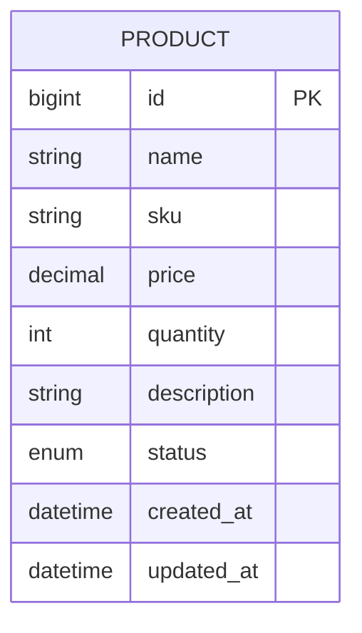
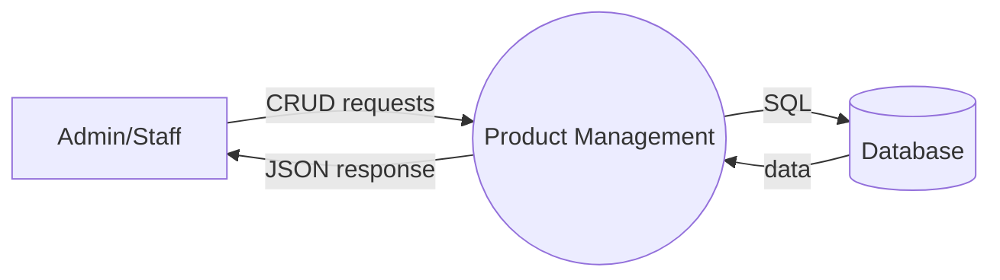
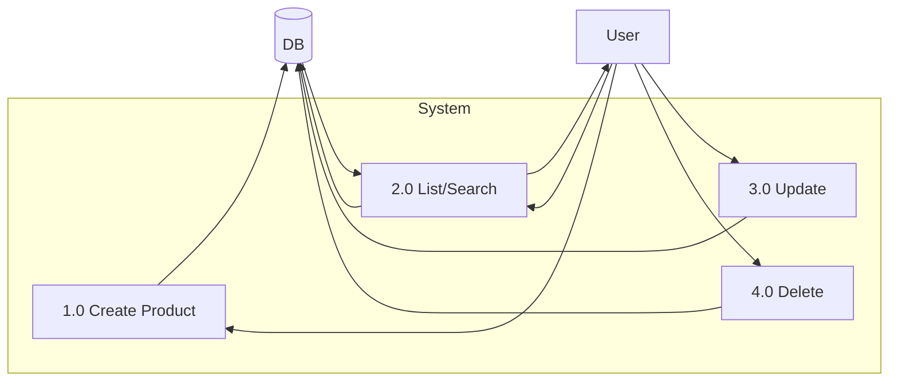

# LAB 3.4 – System Modeling (ERD + DFD)

## ERD (Mermaid)

```mermaid
erDiagram
  PRODUCT {
    bigint id PK
    string name
    string sku
    decimal price
    int quantity
    string description
    enum status
    datetime created_at
    datetime updated_at
  }
```
> Mở rộng (nếu cần): ORDER 1–N ORDER_ITEM với PRODUCT.

## DFD Level-0

```mermaid
flowchart LR
  User[Admin/Staff] -->|CRUD requests| System((Product Management))
  System -->|JSON response| User
  System -->|SQL| DB[(Database)]
  DB -->|data| System
```

## DFD Level-1

```mermaid
flowchart LR
  subgraph System
    P1[1.0 Create Product]
    P2[2.0 List/Search]
    P3[3.0 Update]
    P4[4.0 Delete]
  end
  User --> P1 --> DB[(DB)]
  User --> P2
  P2 --> DB --> P2 --> User
  User --> P3 --> DB
  User --> P4 --> DB
```
